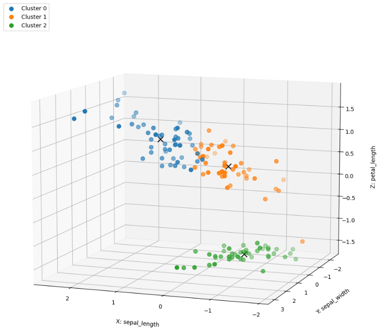
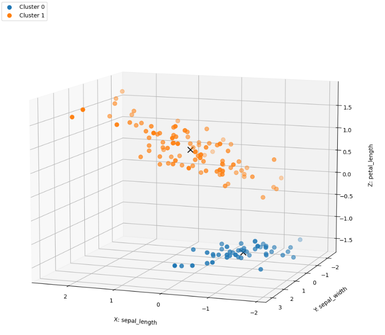
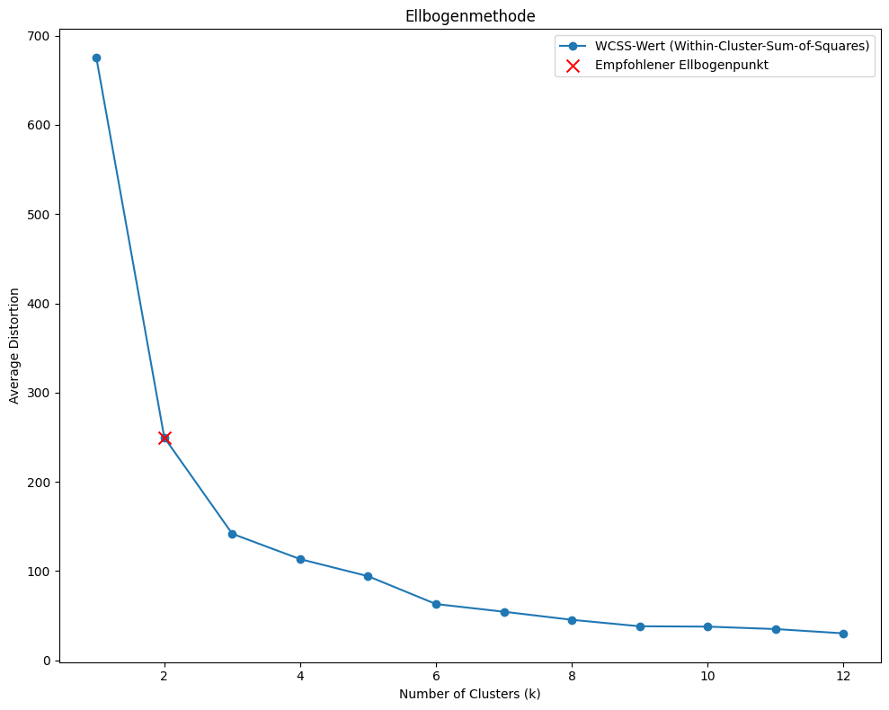
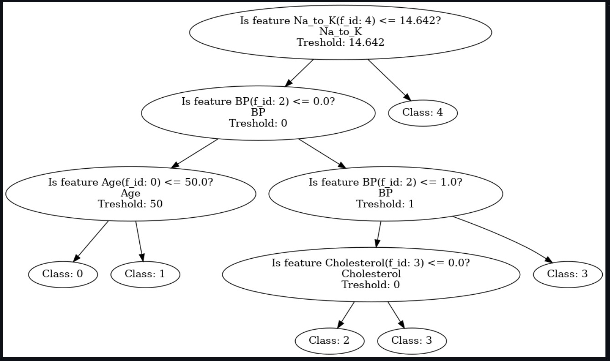

# Projektbeschreibung

Dieses Projekt ist als Prüfungsleistung im Rahmen des Moduls "Programmierprojekt" entstanden. Es repräsentiert die Leistung des Backend-Teams. Das Projekt stellt eine API bereit, mit der Datenpunkte mithilfe des Clustering-Algorithmus gruppiert werden können. Benutzer können ihre Daten in Form von Excel-Dateien hochladen, und die API gibt die geclusterten Datenpunkte zurück.

## Inhaltsverzeichnis

- [Voraussetzungen](#voraussetzungen)
- [Installation und Einrichtung](#installation-und-einrichtung)
- [Repository-Struktur](#repository-struktur)
- [Deployment](#deployment)
- [API-Dokumentation](#api-dokumentation)
- [Technologie-Stack](#technologie-stack)
- [Konfigurationsmanagement](#konfigurationsmanagement)
- [Beispielhaftes Bildmaterial](#beispielhaftes-bildmaterial)

## Voraussetzungen

- Docker und Docker Compose: Zum Containerisieren der Anwendung.
- LazyDocker: Ein einfacher Terminal-UI für Docker (wird in der ./deploy.sh mitgeliefert).

**Hinweis für Windows-Nutzer:** Die Anwendung funktioniert nur unter Windows Subsystem for Linux (WSL). Sie können WSL mithilfe der [offiziellen Dokumentation](https://docs.microsoft.com/de-de/windows/wsl/install) von Microsoft installieren und einrichten.

## Installation und Einrichtung

```bash
git clone https://github.com/axellotl22/progback
cd progback
```
## Repository-Struktur
```bash
Progback/
│
├── app/                          # Hauptanwendungsverzeichnis
│   ├── routers/                  # FastAPI-Endpunkte und Router
│   ├── models/                   # Datenmodelle, Pydantic-Schemata
│   ├── services/                 # Business-Logik, Dienstprogramme und Hilfsfunktionen
│   ├── database/                 # Datenbankverbindung
│   ├── entitys/                  # Datenbank Modelle für die App 
│   └── main.py                   # Hauptanwendungsdatei (FastAPI-Instanz)
│
├── temp_files/                   # Verzeichnis für temporäre Dateien (z.B. hochgeladene Dateien)
│
├── notebooks/                    # Jupyter-Notebooks für Datenanalyse und Prototyping
│
├── tests/                        # Testverzeichnis mit Testfällen und Fixtures
│
├── .github/                      # GitHub-spezifische Dateien
│   └── workflows/                # CI/CD-Workflows und Automatisierungsskripte
│
├── deploy.sh                     # Skript für die automatisierte lokale Bereitstellung
├── docker-compose.yml            # Docker-Compose-Konfigurationsdatei
├── Dockerfile                    # Docker-Konfigurationsdatei für den Anwendungscontainer
├── .gitignore                    # Liste von Dateien/Verzeichnissen, die von Git ignoriert werden
├── .env.example                  # Beispiel- und Vorlagendatei für Umgebungsvariablen
├── requirements.txt              # Liste der Python-Abhängigkeiten
└── README.md                     # Dokumentation und allgemeine Projektinformationen

```

## Deployment

Ein Deployment der Clustering-API kann auf verschiedene Arten erfolgen. In diesem Abschnitt werden die Verfahren für die Verwendung von Docker, Docker Compose und dem bereitgestellten `deploy.sh`-Skript beschrieben.

### Deployment mit Docker

Docker ermöglicht es Ihnen, Ihre Anwendung in einem isolierten Container auszuführen. Um Ihre Anwendung mit Docker zu deployen, führen Sie die folgenden Schritte aus:

1. Erstellen Sie das Docker-Image:

   ```bash
   docker build -t clustering-api --build-arg DEV_MODE=True .
2. Starten Sie den Container:

    ```bash
    docker run -p 8080:8080 --env-file .env clustering-api
    ```


### Deployment mit Docker Compose
Docker Compose ermöglicht die Definition und den Betrieb von Multi-Container Docker-Anwendungen. Um die Clustering-API mit Docker Compose zu deployen, gehen Sie wie folgt vor:

```bash
# Erstellen Sie die Docker-Images und starten Sie die Container
docker-compose --env-file .env up --build
```


### Deployment mit deploy.sh
Das deploy.sh-Skript ist ein hilfreiches Werkzeug, das die Einrichtung und das Deployment der Clustering-API automatisiert. Um dieses Skript zu verwenden:

```bash
# Stellen Sie sicher, dass das Skript ausführbar ist
chmod +x deploy.sh

# Führen Sie das Skript aus:
./deploy.sh
```

Das Skript wird automatisch LazyDocker installieren (wenn es noch nicht installiert ist), alle bestehenden Container stoppen, neue Images erstellen, die Container starten und anschließend LazyDocker für die Containerüberwachung ausführen.

## API-Dokumentation
Die RESTful Webservice-API wird über [Swagger](https://swagger.io/) dokumentiert. Die Dokumentation kann auf der folgenden
URL aufgerufen werden: http://localhost:8080/docs

## Technologie-Stack

### Framework: FastAPI


Bibliotheken: Einige der Schlüsselbibliotheken, die in diesem Projekt verwendet werden, sind:
- Pandas
- Numpy
- Scikit-learn (sklearn)
- SQLAlchemy
- Numba

## Konfigurationsmanagement

1. .env Datei erzeugen:
    ``` bash 
   cp .env.example .env
   ```

2. Umgebungsvariablen konfigurieren:
    ```bash
    # Umgebungsvariablen konfigurieren
    TEST_MODE=False 
    DEV_MODE=True 

    # Database Config 
    DB_HOST=
    DB_PORT=
    DB_PW=
    DB_SCHEMA=

    # User Config
    APP_SECRET=
    VERIFICATION_SECRET=
    ```
## Beispielhaftes Bildmaterial
### Visualisierung Basic-3D-Clustering der Datei IRIS.csv 
- column1, column2, column3 : 0, 1, 2
- distance_metric: EUCLIDEAN
- k_clusters : 3 (vorgegeben)
- kmeans_type: OptimizedKMeans
- normalize: True



### Visualisierung Advanced-3D-Clustering der Datei IRIS.csv 
- column1, column2, column3 : 0, 1, 2
- distance_metric: EUCLIDEAN
- kmeans_type: OptimizedKMeans
- normalize: True



### Visualisierung Ellbogenmethode der Datei IRIS.csv 



### Visualisierung Decission-Tree der Datei drug200.csv

